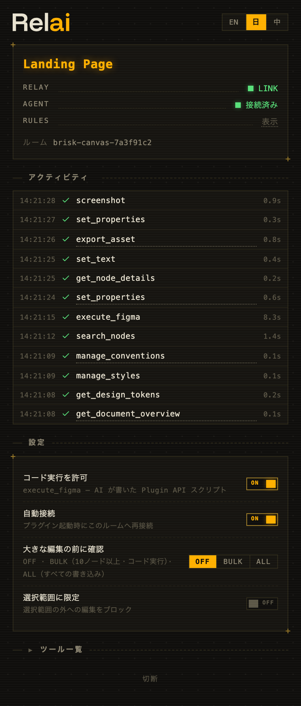

[English](README.md) | 日本語 | [中文](README.zh.md)

[figma-relai.vercel.app](https://figma-relai.vercel.app)

**Your AI, on the canvas.** Relai は Claude Code・Cursor・Codex など任意の MCP クライアントを Figma につなぎ、いつものモデルとの会話で、読み取り・編集・チェックからデザインシステム構築までをできるようにします。書き込みは有料 REST API ではなく Figma プラグインを経由するため、すべての Figma プランで動きます。そしてファイル自身が、あなたの決めごとを覚えていきます。

Relai の立場はシンプルです。AI の時代、デザイナーの主導権はむしろ大きくなるべきです。判断と好みは手元に。作業は、すでに信頼しているモデルへ。すべての手順が見えるかたちで。



## セッションはこう進む

> **あなた:** CTA を目立たせて、角も丸めて。
>
> **AI:** `set_properties · 3 nodes · 0.4s ✓` → `verify_visual · match ✓`
>
> **あなた:** この画面全体をダークモードにして。
>
> **AI:** `set_properties · 24 nodes · 1.2s ✓` → `analyze_design · overall → 92/100`

コマンドは実行と同時にプラグインに並びます。所要時間と、成功か失敗か。行をクリックすれば該当レイヤーへ移動。気が変わったら **Stop** を押せば、残りのバッチは取り消されます。

数字はそのまま大きくなります。Relai は、作者が実際に運用しているデザインシステムの面倒を見る道具です。以下はそのセッションのひとつからの抜粋です。2026 年 7 月、加工なし:

```text
audit_colors     45,509 nodes scanned · 3.9s
ghost census     30,251 stale references found
approval gate    designer approved · scope: full file
batch_execute    25,351 bindings rebound
re-census        30,251 → 936 · zero visual change
```

## はじめる

必要なのは [Figma Desktop](https://www.figma.com/downloads/)、[Node.js](https://nodejs.org/) 18+、MCP クライアントです。

**1. プラグインを導入する。** [Figma Community](https://www.figma.com/community/plugin/1662131506342078142) から入手して実行します。自動で接続し、再起動後もルームを記憶します。

**2. サーバーを登録する。** AI クライアントに次を追加します:

```bash
claude mcp add Relai -- npx -y figma-relai      # Claude Code
codex mcp add Relai -- npx -y figma-relai       # Codex CLI
```

Cursor の場合は `.cursor/mcp.json` に:

```json
{ "mcpServers": { "Relai": { "command": "npx", "args": ["-y", "figma-relai"] } } }
```

**3. 頼んでみる。** ペアリングは自動です。ウィンドウ間でコピーするものはありません。

## 得意なこと

デザインを理解する。「この画面、どう組み立てられてる?」で構造・色・レイアウト・トークンの利用状況が一度に返ります。AI はスクリーンショットでキャンバスを実際に確認できるので、推測で答えません。

一括編集。「ボタンのラベルを全部英語に」「この画面をダークモードに」が、何十レイヤーでも一往復で終わります。クリック作業の午後は不要です。

チェック。`analyze_design` はカラートークンの網羅性、オートレイアウトの品質、コンポーネントの健全性、アクセシビリティ(WCAG コントラスト、タッチターゲット、文字サイズ)を確認します。重み付きの 0〜100 ヘルススコアにまとめて、そのままレビューに出すこともできます。さらに、AI に任せる準備がどこまで整っているかの採点(足りない箇所つき)、このファイルがよく使う角丸・余白・文字サイズの傾向の集計、削除済みの変数をまだ参照している箇所の数え上げまで。

デザインシステム。モード付きの変数コレクション、トークンの割り当て、共有スタイル、正しいバリアント、チームライブラリの導入。`get_design_system` がファイルと使用中ライブラリの持ち物を棚卸しするので、AI は似た見た目を描き直すのではなく、手元のコンポーネントから組み立てます。`analyze_design` の tokens は、既存の変数と見た目が一致するハードコード値を見つけ、`tokenize` 一発で全部つなぎます。これらは事前条件チェック付きの宣言的な操作なので、同じ依頼はいつも同じ挙動になり、失敗したときはスタックトレースではなく「先に set_layout_mode を呼ぶ」といった次の一手が返ります。

それ以外の全部。`execute_figma` は Figma Plugin API を直接扱う JavaScript を実行します。公式 MCP と同じ発想の最後の手段ですが、正しい書き方が最短の書き方になる `relai.*` ヘルパー、既知のエラーに添付されるヒント、静かな間違いを拾うリントが付きます。AI にコードを実行させたくなければ、プラグインの「Allow code execution」をオフに。

## ファイルが決めごとを持ち歩く

本来なら毎回プロンプトに貼るようなルールを、Figma ファイル自身が持ちます。だから次のセッションは、どの MCP クライアントからでも、ファイルを開いた誰でも、下調べ済みの状態から始まります。

**規約**は、ファイルに保存された小さな CLAUDE.md です。命名、トークンの通し方、余白の癖。AI は作業の前にこれを読みます。

**メモリー**は判例を持ちます。一度「ここの余白はわざと」と決めれば、その判断はファイルに記録され、参照先に触れる編集には、あなたの言葉が結果に添付されます:

```text
you        "this gap is on purpose — remember it"
file       record_precedent · saved ✓

(another session, a different AI, about to "fix" the gap)
file       precedent attached — "…is on purpose" · the edit backs off
```

パネルの MEMORY 行に全件が並び、いつでも削除できます。黙って記録されるものはありません。

**立入禁止(NO-GO)**はページごと囲います。ブランドのマスター、法務、もうピクセル単位で完成しているあのページ。囲ったページへの書き込みは実行の手前で拒否され、理由が記録に残ります。囲いを編集できるのはデザイナーだけです。

**確認**は 4 段階のレベルです(OPEN · RISK · BULK · ALL)。既定の RISK では、危険な操作だけが確認を求めます(変数/スタイルの削除、detach、flatten)。それ以外は止まりません。パネルから決めるもの。AI には動かせません。

## 主導権はあなたに

プラグインはデザイナー側の受け持ちです。AI のすべての動作が流れる実行フィード、agent が本当にペアリングしているときだけ点く AI 接続インジケーター(サーバーが起動しているだけでは点きません)、保留中の作業を取り消す Stop ボタン。あなたの選択やページ移動はイベントとして AI に流れるので、「これも同じように」が説明なしで通じます。

**Lock to selection** は、選択範囲の外への編集を拒否します。AI には明確なエラーが返り、黙って通ることはありません。リレーはローカルで動き、ファイルの内容は Figma・手元のマシン・すでに信頼している AI クライアントの間だけを移動します。UI は English・日本語・中文に対応。

## 仕組み

```
AI (any MCP client)
  ↕ stdio
MCP server            32 tools · analysis · verification
  (embedded relay)    WebSocket room hub on 127.0.0.1:9055
  ↕ WebSocket
Figma plugin          executes Plugin API calls
```

リレーは MCP サーバーの中にいるので、別プロセスを立てておく必要はありません。複数の MCP クライアントが同時に動くときは、最初の 1 つがリレーを担い、他はそこへ接続します。担い手が終了したら、残った 1 つが引き継ぎます。両側ともルームを記憶していて、再起動やスリープの後も自分たちで再会します。`join_room` ツールの出番は 1 つだけ。2 つの Figma ファイルが同時にプラグインを動かしているときです。

ポートは Figma のプラグインサンドボックスが決めています。manifest が許可するのは `ws://localhost:9055–9057` で、それ以外のポートは `manifest.json` を書き換えない限り使えません。UI にポート設定がないのはそのためです。

## ツール一覧

| グループ | ツール |
|-------|-------|
| コンテキスト | `get_document_overview` · `get_selection_context` · `get_node_details` · `search_nodes` · `get_design_tokens` · `screenshot` · `get_events` |
| 分析 | `analyze_design`(color / layout / components / accessibility / overall)· `diff_nodes`(比較、またはチェックポイント保存/比較) |
| 検証 | `verify_changes` · `validate_design_rules` · `verify_visual` |
| 読み取り | `get_node_data`(summary / tree / full / css / variables) |
| 作成・編集 | `create_node` · `set_properties` · `set_text` · `edit_structure` |
| コンポーネント | `manage_components` |
| デザインシステム | `get_design_system` · `manage_variables` · `manage_styles` · `import_from_library` · `manage_conventions` |
| ドキュメント | `manage_pages` · `navigate` |
| アセット | `export_asset` · `add_image` |
| 注釈 | `annotate` |
| コメント | `manage_comments`(トークンが必要。下記参照) |
| 上級 | `batch_execute` · `execute_figma` · `join_room` |

各ツールは自己記述式で、AI には完全なパラメータドキュメントが見えます。同じ契約はファイルとしても存在します。`npx figma-relai manifest` は、全ツールのスキーマ・プラグインコマンド・既知の落とし穴を機械可読 JSON で出力します。ビルドごとに実行コードから生成されるので(`docs/manifest.json` としてコミット済み)、ドリフトしません。`npx figma-relai docs <tool>` は人間向けに整形します。あわせて 11 本のスキル文書が MCP プロンプトとして同梱されます。トークン戦略、コンポーネント規約、チェックのワークフロー、QA ゲート、`execute_figma` 用 Plugin API チートシート、ファイルのメモリーと判例、そしてデザインシステムファースト構築・一括整理・コメント駆動コラボのレシピ。自作スキルも読み込めます。name/description のフロントマター付き markdown を `~/.figma-relai/skills/` に置けば、`user:` プロンプトとして登録されます。

## Relai と公式の Figma MCP

Figma 自身の AI は急速に育っています。公式 MCP サーバーはキャンバスへの書き込みに対応し、Figma Design Agent はエディタの中で協働します。どちらもフルシートの有料プラン向けで、利用は AI クレジットで計量され、モデルは Figma が選びます。Relai はその線の反対側にあるオープンソースです。無料を含む全プラン、いつものモデルといつもの契約、すべて手元のマシンで、コントロールはデザイナーの手に。シートがあるなら、両方を走らせて共存できます。

## オプション:コメント

コメントは Figma の REST API の向こう側にあり、パーソナルアクセストークンが必要です。figma.com → Settings → Security で(コメントのスコープを有効にして)発行し、MCP 設定に追加します:

```json
{ "mcpServers": { "Relai": { "command": "npx", "args": ["-y", "figma-relai"],
  "env": { "FIGMA_TOKEN": "figd_..." } } } }
```

トークンは設定ファイルに留まり、送信先は `api.figma.com` だけです。他のツールはトークンなしで全部動きます。トークンがあると、「コメントのフィードバックを反映して」が実際に動きます。スレッドを読み、編集し、返信する。静かなワークフローも解禁されます。キャンバスに @ コメントをタスクとして残しておき、あとで AI に「コメントを見て」と言うだけ。スレッドを引き受けて、作業して、そこに報告します。

## トラブルシューティング

まず `npx figma-relai doctor` を。Node、リレーポート(よそのプロセスが座っていないかも)、プラグインの導入状況、保存済みルーム、コメントトークンを 1 コマンドで点検し、それぞれに直し方を添えます。

**プラグインが NO SERVER と表示する。** ポート 9055–9057 で待つ MCP サーバーがありません。AI クライアントが起動していないか、Relai が登録されていないのがほとんどです。パネルに登録コマンドがそのまま表示されます。プラグインはダイヤルし続け、サーバーが現れた瞬間につながります。

**RELAY は LINK なのに AGENT が WAITING。** 配管は正常です。この セッションで AI がまだ Figma ツールを呼んでいないだけ。ファイルについて何か聞いてみてください。

**「複数の Figma プラグインが接続しています」。** 2 つのファイルがプラグインを動かしています。操作したい方のプラグインに表示されているルーム名で `join_room` するよう AI に伝えてください。

**初回の `npx` が遅い。** パッケージを一度ダウンロードしているだけです。次回からは速くなります。

## セキュリティ

リレーは `127.0.0.1` にのみバインドし、認証はルーム名だけです(暗号学的にランダムなサフィックス付き)。`execute_figma` は AI の書いたコードを Figma のプラグインサンドボックス内で実行します。既定でオン、実行はすべてフィードに見え、デザイナーはオフにできます。スクリプトはアトミックではありません。失敗したスクリプトでも、途中までの変更は残ります。脅威モデルの全体は [SECURITY.md](SECURITY.md) を。

## コントリビューター向け

```bash
git clone https://github.com/syoooo/figma-relai.git
cd figma-relai
bun setup       # install, build, write local MCP configs
bun test
```

[Bun](https://bun.sh/) v1.0+ が必要です(セットアップスクリプトは bash。Windows は WSL で)。プラグインは **Plugins → Development → Import plugin from manifest…** → `packages/figma-plugin/manifest.json` で読み込みます。リレーを別マシンで動かす珍しいケースのために、スタンドアロン版(`bun socket`)もあります。詳しくは [CONTRIBUTING.md](CONTRIBUTING.md)、手動 QA は [docs/smoke-checklist.md](docs/smoke-checklist.md) を。

## ライセンス

MIT — [LICENSE](LICENSE) を参照。
