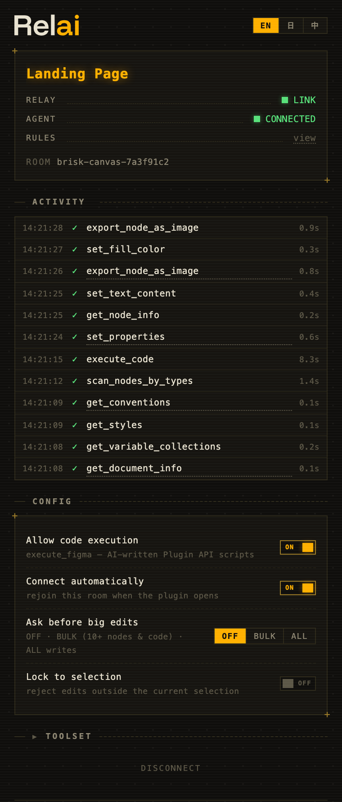

English | [日本語](README.ja.md) | [中文](README.zh.md)

**Your AI, on the canvas.** Relai connects Claude Code, Cursor, Codex — any MCP client — to Figma, so you can read, edit, audit, and build design systems by talking to the model you already use. It works on every Figma plan, because writes go through a Figma plugin rather than the paid REST API.



## What a session looks like

> **You:** Make the CTA pop and round it off.
>
> **AI:** `set_properties · 3 nodes · 0.4s ✓` → `verify_visual · match ✓`
>
> **You:** Now sweep the whole screen for dark mode.
>
> **AI:** `set_properties · 24 nodes · 1.2s ✓` → `analyze_design · overall → 92/100`

Every command shows up in the plugin as it runs, with timing and success or failure. Click an entry to jump to that layer on the canvas. Press **Stop** if you change your mind — the rest of the batch is cancelled.

## Get started

You need [Figma Desktop](https://www.figma.com/downloads/), [Node.js](https://nodejs.org/) 18+, and an MCP client.

**1. Install the plugin.** Get it from [Figma Community](https://www.figma.com/community/plugin/1662131506342078142) and run it. It connects on its own and remembers its room across restarts.

**2. Register the server** with your AI client:

```bash
claude mcp add Relai -- npx -y figma-relai      # Claude Code
codex mcp add Relai -- npx -y figma-relai       # Codex CLI
```

For Cursor, add this to `.cursor/mcp.json`:

```json
{ "mcpServers": { "Relai": { "command": "npx", "args": ["-y", "figma-relai"] } } }
```

**3. Ask for something.** Pairing is automatic; there is nothing to copy between windows. The `join_room` tool exists for one rare case only: two Figma files running the plugin at the same time.

## What it's good at

Understanding a design. "How is this screen put together?" gets you structure, colors, layout, and token usage in one pass, and the AI can take a screenshot to actually look at the canvas rather than guess.

Bulk edits. "Translate every button label to English" or "recolor this for dark mode" become one round-trip across dozens of nodes instead of an afternoon of clicking.

Audits. `analyze_design` checks color-token coverage, auto-layout quality, component health, and accessibility (WCAG contrast, touch targets, text sizes) — or all four at once as a weighted 0–100 health score you can put in a review.

Design systems. Variable collections with modes, token binding, shared styles, components with proper variants, team-library imports. `get_design_system` inventories what the file — and the libraries it uses — already has, so the AI builds from your components instead of redrawing near-copies; `analyze_design`'s tokens aspect finds hardcoded values that visually match an existing variable, and one `tokenize` call binds them all. These run as declarative operations with precondition checks, so the same request behaves the same way every time, and a failure tells the AI what to do next ("call set_layout_mode first") instead of dumping a stack trace.

Everything else. `execute_figma` runs JavaScript against the Figma Plugin API directly — the same escape-hatch approach as Figma's official MCP — with a `relai.*` helper library that makes the correct pattern the shortest one, hints attached to known errors, and a lint that flags silent mistakes. If you'd rather the AI never ran code, turn it off with the plugin's "Allow code execution" toggle.

## You stay in control

The plugin is the designer's side of the deal: a live activity feed of everything the AI does, an "AI connected" indicator that means an agent is actually paired (not just that a server is running), and a Stop button that cancels pending work. Selection and page changes you make flow back to the AI as events, so "now do the same to this one" works without re-explaining.

Three dials go further when you want them. **Approvals** ("Ask before big edits") holds bulk writes and code execution until you press Approve in the panel. **Lock to selection** rejects edits outside whatever you've selected — the AI gets a clear error, not a silent pass. And **file conventions** are a little CLAUDE.md stored inside the Figma file itself: naming rules, spacing habits, do-not-touch pages — every future session, from any AI client, reads it before working. The UI speaks English, 日本語, and 中文.

## How it works

```
AI (any MCP client)
  ↕ stdio
MCP server            30 tools · analysis · verification
  (embedded relay)    WebSocket room hub on 127.0.0.1:9055
  ↕ WebSocket
Figma plugin          executes Plugin API calls
```

The relay lives inside the MCP server, so there is no extra process to keep alive. When several MCP clients run at once, the first one hosts the relay and the others connect to it; if the host exits, a survivor takes over. Both sides remember their room, rejoin after restarts or sleep, and find each other without any copy-pasting.

Ports are fixed by Figma's plugin sandbox: the manifest allowlists `ws://localhost:9055–9057`, and other ports cannot work without editing `manifest.json`. That's why there is no port setting in the UI.

## The tools

| Group | Tools |
|-------|-------|
| Context | `get_document_overview` · `get_selection_context` · `get_node_details` · `search_nodes` · `get_design_tokens` · `screenshot` · `get_events` |
| Analysis | `analyze_design` (color / layout / components / accessibility / overall) · `diff_nodes` (compare, or checkpoint save/compare) |
| Verification | `verify_changes` · `validate_design_rules` · `verify_visual` |
| Read | `get_node_data` (summary / tree / full / css / variables) |
| Create & edit | `create_node` · `set_properties` · `set_text` · `edit_structure` |
| Components | `manage_components` |
| Design system | `get_design_system` · `manage_variables` · `manage_styles` · `import_from_library` · `manage_conventions` |
| Document | `manage_pages` · `navigate` |
| Assets | `export_asset` · `add_image` |
| Annotations | `annotate` |
| Comments | `manage_comments` (needs a token — see below) |
| Advanced | `batch_execute` · `execute_figma` · `join_room` |

Each tool is self-describing, so the AI sees full parameter docs. Nine skill documents ship alongside as MCP prompts: token strategy, component conventions, audit workflows, a Plugin API cheat sheet for `execute_figma`, and recipes for design-system-first building, bulk cleanup, and comment-driven collaboration.

## Relai and Figma's official MCP

Figma's own AI has grown fast — the official MCP server now writes to the canvas, and the Figma Design Agent collaborates right inside the editor. Both are excellent, and both belong to full seats on paid plans, with usage metered in AI credits and models chosen by Figma. Relai is the open-source counterpart on the other side of that line: every plan including free, whatever model and subscription you already use, everything running on your machine, and the designer holding the controls. If you have the seats, the two coexist happily — run both.

## Optional: comments

Comments live behind Figma's REST API, which needs a personal access token. Generate one at figma.com → Settings → Security (enable comment scopes), then add it to your MCP config:

```json
{ "mcpServers": { "Relai": { "command": "npx", "args": ["-y", "figma-relai"],
  "env": { "FIGMA_TOKEN": "figd_..." } } } }
```

The token stays in your config file and is sent only to `api.figma.com`. Every other tool works without it. With it, "apply the feedback in the comments" becomes a thing the AI can actually do: read the threads, make the edits, reply. It also unlocks a quiet workflow: leave an @-comment on the canvas as a task, then tell your AI to "check the comments" — it claims the thread, does the work, and reports back on it.

## Troubleshooting

**The plugin shows NO SERVER.** No MCP server is listening on ports 9055–9057, which usually means your AI client isn't running or Relai isn't registered in it. The panel shows the exact registration command; the plugin keeps dialing and connects the moment a server appears.

**RELAY says LINK but AGENT says WAITING.** The plumbing is fine — the AI just hasn't called a Figma tool yet in this session. Ask it something about the file.

**"Multiple Figma plugins are connected."** Two files are running the plugin. Tell the AI to `join_room` with the room name shown in the plugin you want to control.

**The first `npx` run is slow.** It downloads the package once; later starts are fast.

## Security

The relay binds to `127.0.0.1` only and has no authentication beyond room names, which carry a crypto-random suffix. `execute_figma` runs AI-written code inside Figma's plugin sandbox; it is on by default, every run is visible in the activity feed, and the designer can disable it. Scripts are not atomic — a failed script's earlier changes persist. Full threat model: [SECURITY.md](SECURITY.md).

## For contributors

```bash
git clone https://github.com/syoooo/figma-relai.git
cd figma-relai
bun setup       # install, build, write local MCP configs
bun test
```

Requires [Bun](https://bun.sh/) v1.0+ (the setup script is bash; on Windows use WSL). Load the plugin via **Plugins → Development → Import plugin from manifest…** → `packages/figma-plugin/manifest.json`. A standalone relay (`bun socket`) exists for the unusual case where the relay must run on another machine. More in [CONTRIBUTING.md](CONTRIBUTING.md); manual QA lives in [docs/smoke-checklist.md](docs/smoke-checklist.md).

## License

MIT — see [LICENSE](LICENSE).
