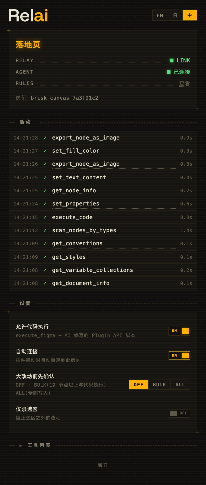

[English](README.md) | [日本語](README.ja.md) | 中文

**Your AI, on the canvas.** Relai 把 Claude Code、Cursor、Codex——任何 MCP 客户端——接进 Figma：对你常用的那个模型说话，就能读取、编辑、审计设计，直至搭建整套设计系统。写入走 Figma 插件而非付费 REST API，所以任何 Figma 套餐都能用。



## 一次会话长什么样

> **你：** 让 CTA 更醒目，圆角处理一下。
>
> **AI：** `set_properties · 3 nodes · 0.4s ✓` → `verify_visual · match ✓`
>
> **你：** 现在把整个页面扫一遍，换成暗色模式。
>
> **AI：** `set_properties · 24 nodes · 1.2s ✓` → `analyze_design · overall → 92/100`

每条命令执行时都会出现在插件里，带耗时和成败。点击条目即可跳转到画布上的对应图层。改主意了就按**停止**——批量任务的剩余部分立刻取消。

## 开始使用

需要 [Figma Desktop](https://www.figma.com/downloads/)、[Node.js](https://nodejs.org/) 18+ 和一个 MCP 客户端。

**1. 安装插件。** 从 [Figma Community](https://www.figma.com/community/plugin/1662131506342078142) 获取并运行。它会自动连接，重启后也记得自己的房间。

**2. 在 AI 客户端里注册服务器：**

```bash
claude mcp add Relai -- npx -y figma-relai      # Claude Code
codex mcp add Relai -- npx -y figma-relai       # Codex CLI
```

Cursor 用户在 `.cursor/mcp.json` 中添加：

```json
{ "mcpServers": { "Relai": { "command": "npx", "args": ["-y", "figma-relai"] } } }
```

**3. 开口提需求。** 配对全自动，窗口之间无需复制任何东西。`join_room` 工具只服务一种罕见场景：两个 Figma 文件同时运行插件。

## 它擅长什么

理解设计。一句"这个页面是怎么搭的？"就能拿到结构、颜色、布局和 token 使用情况，AI 还会截图亲眼确认画布，而不是靠猜。

批量编辑。"把所有按钮文案翻译成英文""改成暗色配色"——原本一下午的点击，变成横跨几十个节点的一次往返。

审计。`analyze_design` 检查颜色 token 覆盖率、auto-layout 质量、组件健康度和可访问性（WCAG 对比度、触摸目标、文字尺寸），也可以四项合一输出加权 0–100 健康分，直接贴进评审。

设计系统。带模式的变量集合、token 绑定、共享样式、带完整变体的组件、团队库导入。`get_design_system` 盘点文件与其所用库里已有的资产，AI 从你的组件出发拼装，而不是重画一个"长得很像"的图形；`analyze_design` 的 tokens 维度能找出与现有变量视觉一致的硬编码值，一句 `tokenize` 全部绑定归位。这些以带前置条件校验的声明式操作执行——同样的请求每次行为一致，失败时返回的是下一步指引（"先调用 set_layout_mode"）而不是堆栈。

其余一切。`execute_figma` 直接对 Figma Plugin API 执行 JavaScript（与官方 MCP 相同的逃生门思路），配有让正确写法成为最短写法的 `relai.*` 助手库、已知错误自带解药提示、以及捕捉静默错误的 lint。不想让 AI 跑代码？插件的"允许代码执行"开关随时关掉。

## 主导权在设计师手里

插件就是设计师这一侧的窗口：AI 一举一动尽收眼底的活动流；"AI 已连接"指示灯亮起意味着智能体真的配对上了，而不只是某个服务器在跑；停止按钮随时取消待执行的工作。你的选区和页面切换会作为事件流回 AI，"现在对这个做同样的事"不需要重新解释。

想握得更紧，还有三道开关。**审批**("大改动前先确认")会把批量写入和代码执行拦在面板里，等你按下批准。**仅限选区**阻止选区之外的一切改动——AI 收到的是明确报错，不是默许。**文件规约**则是存在 Figma 文件体内的一份小 CLAUDE.md：命名规则、间距习惯、禁碰页面——此后每个会话，无论来自哪个 AI 客户端，动手前都会先读它。界面支持 English、日本語、中文。

## 工作原理

```
AI（任意 MCP 客户端）
  ↕ stdio
MCP 服务器            30 个工具 · 分析 · 验证
  （内嵌 relay）       127.0.0.1:9055 的 WebSocket 房间中枢
  ↕ WebSocket
Figma 插件            执行 Plugin API 调用
```

relay 住在 MCP 服务器体内，没有需要常驻的额外进程。多个 MCP 客户端并存时，先启动的托管 relay，其余接入；host 退出后由剩下的客户端接管。两端都记住自己的房间，重启或休眠后自动重连——整条链路没有一次复制粘贴。

端口由 Figma 插件沙箱写死：manifest 只允许 `ws://localhost:9055–9057`，其他端口不改 `manifest.json` 就无法工作。这就是界面里刻意不设端口选项的原因。

## 工具一览

| 分组 | 工具 |
|------|------|
| 上下文 | `get_document_overview` · `get_selection_context` · `get_node_details` · `search_nodes` · `get_design_tokens` · `screenshot` · `get_events` |
| 分析 | `analyze_design`（color / layout / components / accessibility / overall）· `diff_nodes`（双节点比较，或检查点保存/对比） |
| 验证 | `verify_changes` · `validate_design_rules` · `verify_visual` |
| 读取 | `get_node_data`（summary / tree / full / css / variables） |
| 创建与编辑 | `create_node` · `set_properties` · `set_text` · `edit_structure` |
| 组件 | `manage_components` |
| 设计系统 | `get_design_system` · `manage_variables` · `manage_styles` · `import_from_library` · `manage_conventions` |
| 文档 | `manage_pages` · `navigate` |
| 资产 | `export_asset` · `add_image` |
| 标注 | `annotate` |
| 评论 | `manage_comments`（需令牌，见下文） |
| 高级 | `batch_execute` · `execute_figma` · `join_room` |

每个工具都是自描述的，AI 能看到完整参数文档。这份契约也以文件形式存在：`npx figma-relai manifest` 输出机器可读的 JSON——全部工具 schema、插件命令表、已知陷阱，每次构建从运行中的代码生成(以 `docs/manifest.json` 入库)，结构上不可能与实现漂移；`npx figma-relai docs <tool>` 则把同一份渲染给人看。随包附带 9 份 skill 文档，以 MCP prompts 形式提供：token 策略、组件规约、审计工作流、`execute_figma` 的 Plugin API 速查表，以及设计系统优先建屏、批量清理、评论驱动协作的实战配方。

## Relai 与 Figma 官方 MCP

Figma 自家的 AI 进化得很快——官方 MCP 服务器已能直接写画布，Figma Design Agent 更是就在编辑器里与你协作。两者都很出色，也均为付费计划完整席位专属：用量按 AI credits 计费，模型由 Figma 指定。Relai 是这条线另一侧所有人的开源对应物：包括免费版在内的任何套餐、你已在用的任何模型和订阅、一切都跑在你自己的机器上，而主导权始终握在设计师手里。如果你有席位,两者可以愉快共存——都用上。

## 可选：评论

评论在 Figma REST API 的那一侧，需要个人访问令牌。到 figma.com → Settings → Security 生成一个（勾选评论权限），加进 MCP 配置：

```json
{ "mcpServers": { "Relai": { "command": "npx", "args": ["-y", "figma-relai"],
  "env": { "FIGMA_TOKEN": "figd_..." } } } }
```

令牌只待在你的配置文件里，只发往 `api.figma.com`。其余所有工具无需令牌。有了它，"把评论里的反馈都改了"就成为 AI 真正做得到的事：读完线程、动手修改、回复评论。它还解锁一种安静的工作流：在画布上留一条 @评论当任务，然后对 AI 说"看看评论"——它会认领线程、完成工作，并回到同一条线程汇报。

## 疑难排解

先跑 `npx figma-relai doctor`——一条命令体检 Node、relay 端口(包括是否被无关进程占用)、插件是否在线、已存房间、评论令牌，每项都附带修法。

**插件显示 NO SERVER。** 端口 9055–9057 上没有 MCP 服务器在监听——通常是 AI 客户端没启动，或还没注册 Relai。面板上就写着注册命令；插件会持续拨号，服务器一出现立刻连上。

**RELAY 是 LINK，AGENT 却一直 WAITING。** 管线没问题——只是 AI 在本会话还没调用过 Figma 工具。问它点关于这个文件的事。

**"Multiple Figma plugins are connected"。** 有两个文件在跑插件。告诉 AI 用你想操控的那个插件里显示的房间名执行 `join_room`。

**第一次 `npx` 很慢。** 它在下载包，仅此一次，之后启动很快。

## 安全

relay 只绑定 `127.0.0.1`，除房间名（带加密随机后缀）外没有其他鉴权。`execute_figma` 在 Figma 插件沙箱内运行 AI 编写的代码：默认开启、每次执行都出现在活动流里、设计师随时可关。脚本不具原子性——失败脚本此前的改动会保留。完整威胁模型见 [SECURITY.md](SECURITY.md)。

## 贡献者

```bash
git clone https://github.com/syoooo/figma-relai.git
cd figma-relai
bun setup       # 安装 + 构建 + 写出指向本地构建的 MCP 配置
bun test
```

需要 [Bun](https://bun.sh/) v1.0+（安装脚本为 bash，Windows 请用 WSL）。插件通过 **Plugins → Development → Import plugin from manifest…** → `packages/figma-plugin/manifest.json` 载入。另有独立 relay（`bun socket`），仅用于 relay 需要跑在另一台机器的特殊场景。更多见 [CONTRIBUTING.md](CONTRIBUTING.md)，手动 QA 见 [docs/smoke-checklist.md](docs/smoke-checklist.md)。

## 许可证

MIT — 见 [LICENSE](LICENSE)。
