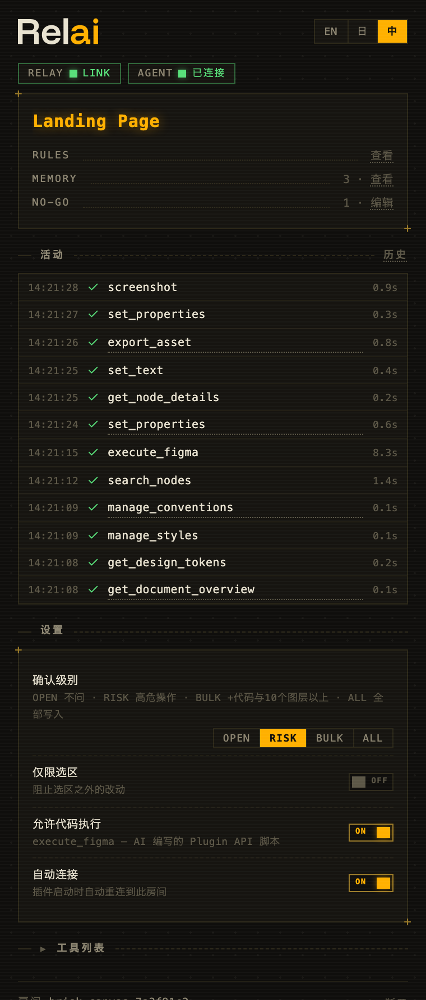

[English](README.md) | [日本語](README.ja.md) | 中文

[figma-relai.vercel.app](https://figma-relai.vercel.app)

**Your AI, on the canvas.** Relai 把 Claude Code、Cursor、Codex——任何 MCP 客户端——接进 Figma：对你常用的那个模型说话，就能读取、编辑、检查设计，直至搭建整套设计系统。写入走 Figma 插件而非付费 REST API，所以任何 Figma 套餐都能用——而且文件自己会一路记下你的规矩、你拍过的板。

Relai 的立场很简单：AI 时代，设计师的主导权应该变大，而不是变小。判断和品味留在你手里；活交给你已经信任的模型——每一步都看得见。



## 一次会话长这样

> **你：** 让 CTA 更醒目，圆角处理一下。
>
> **AI：** `set_properties · 3 nodes · 0.4s ✓` → `verify_visual · match ✓`
>
> **你：** 把整个界面刷成深色模式。
>
> **AI：** `set_properties · 24 nodes · 1.2s ✓` → `analyze_design · overall → 92/100`

每条命令在执行时同步出现在插件里，带耗时和成败。点击记录可跳转到画布上对应的图层。改主意了就按 **Stop**——剩下的批量任务立即取消。

数字是可以放大的。Relai 是作者维护一套生产设计系统的日常工具，下面就摘自其中一次会话——2026 年 7 月，未经修饰：

```text
audit_colors     45,509 nodes scanned · 3.9s
ghost census     30,251 stale references found
approval gate    designer approved · scope: full file
batch_execute    25,351 bindings rebound
re-census        30,251 → 936 · zero visual change
```

## 开始使用

你需要 [Figma Desktop](https://www.figma.com/downloads/)、[Node.js](https://nodejs.org/) 18+ 和一个 MCP 客户端。

**1. 安装插件。** 从 [Figma Community](https://www.figma.com/community/plugin/1662131506342078142) 获取并运行。它会自行连接，并在重启后记住所在房间。

**2. 注册服务器**，加进你的 AI 客户端：

```bash
claude mcp add Relai -- npx -y figma-relai      # Claude Code
codex mcp add Relai -- npx -y figma-relai       # Codex CLI
```

Cursor 则把下面这段加进 `.cursor/mcp.json`：

```json
{ "mcpServers": { "Relai": { "command": "npx", "args": ["-y", "figma-relai"] } } }
```

**3. 开口提需求。** 配对自动完成，不需要在窗口之间复制任何内容。

## 它擅长什么

理解设计。「这个界面是怎么搭起来的？」一次返回结构、颜色、布局和 Token 使用情况，AI 还能截图真正看一眼画布，而不是靠猜。

批量编辑。「把所有按钮文案换成英文」「这屏刷成深色模式」——几十个图层一个来回搞定，不用点一下午。

检查。`analyze_design` 检查颜色 Token 覆盖、自动布局质量、组件健康度和无障碍性（WCAG 对比度、触达目标、字号），也能合成一个加权 0–100 的健康分直接放进评审。另有三项盘点：文件为 AI 工作准备到什么程度的打分（附最大缺口）、这个文件惯用的圆角/间距/字号统计、以及还指着已删除变量的引用清点。

设计系统。带模式的变量集合、Token 绑定、共享样式、正确的变体、团队库导入。`get_design_system` 会盘点文件及其使用的库已有的家底，让 AI 从你的组件出发构建，而不是照着画一个像的；`analyze_design` 的 tokens 能找出与现有变量视觉一致的硬编码值，一条 `tokenize` 全部绑定。这些都是带前置条件检查的声明式操作：同样的请求每次行为一致，失败时告诉 AI 下一步该做什么（「先调 set_layout_mode」），而不是甩一段堆栈。

其余的一切。`execute_figma` 直接对 Figma Plugin API 执行 JavaScript——与官方 MCP 同款的兜底思路——但带着让正确写法成为最短写法的 `relai.*` 辅助库、附在已知报错上的提示、以及揪出静默错误的 lint。不想让 AI 跑代码，就在插件里关掉「Allow code execution」。

## 文件带着规矩走

那些本来每次都要贴进提示词的规则，现在住在 Figma 文件自己身上——之后的任何会话，无论来自哪个 MCP 客户端、由谁打开文件，都是备过课才开工。

**规约**是存在文件里的一份小 CLAUDE.md：命名规则、Token 路径、间距习惯。AI 动手前先读它。

**记忆**装着你的判例。拍板一次——「这个留白是故意的」——判断就记进文件；之后任何碰到它指的地方的编辑，结果里都会带上你的原话：

```text
you        "this gap is on purpose — remember it"
file       record_precedent · saved ✓

(another session, a different AI, about to "fix" the gap)
file       precedent attached — "…is on purpose" · the edit backs off
```

面板的 MEMORY 行列出全部条目，随时可删。没有任何东西会被悄悄记录。

**Kit。**一个设计师通常照看一个产品，它的文件们共享同一套规矩。把这个文件的规矩存成一个有名字的 kit，其他文件就能用它。Figma 在分支合并时会丢掉文件携带的规矩；kit 会把它放回来——点一下，或者把那套 kit 的自动恢复拨开，连点都不用。

**AI 禁区**整页圈起来——品牌母版、法务页、已经像素级完美的那一页。写入被圈的页面会在碰到画布之前被拒，原因写在回执里，而守卫名单只有你能改。

**确认**是一个四档的级别——OPEN · RISK · BULK · ALL。默认的 RISK 档只有危险操作才会问（删变量或样式、detach、flatten），其余照常放行。档位在面板里定，agent 动不了。

## 主导权在你手里

插件是设计师这一侧的凭据：AI 每个动作都流经的实时活动流、只在 agent 真正配对时才亮的 AI 连接灯（不是服务器开着就亮）、以及取消待办工作的 Stop 按钮。你的选区和翻页会作为事件流回 AI，所以「这个也一样处理」不用重新解释。

**Lock to selection** 拒绝选区之外的编辑——AI 收到的是明确报错，不是静默放行。中继在本地运行：文件内容只在 Figma、你的机器和你已经信任的 AI 客户端之间流动。界面支持 English、日本語、中文。

## 工作原理

```
AI (any MCP client)
  ↕ stdio
MCP server            33 tools · analysis · verification
  (embedded relay)    WebSocket room hub on 127.0.0.1:9055
  ↕ WebSocket
Figma plugin          executes Plugin API calls
```

中继内嵌在 MCP 服务器里，不需要额外保活一个进程。多个 MCP 客户端同时运行时，第一个承担中继，其余连过去；承担者退出后，幸存者接手。两侧都记得自己的房间，重启或休眠后自动重逢，全程无需复制粘贴。`join_room` 工具只为一种少见情况存在：两个 Figma 文件同时运行插件。

端口由 Figma 的插件沙箱决定：manifest 只放行 `ws://localhost:9055–9057`，不改 `manifest.json` 就用不了别的端口。这就是界面里没有端口设置的原因。

## 工具一览

| 分组 | 工具 |
|-------|-------|
| 上下文 | `get_document_overview` · `get_selection_context` · `get_node_details` · `search_nodes` · `get_design_tokens` · `screenshot` · `get_events` |
| 分析 | `analyze_design`（color / layout / components / accessibility / overall）· `diff_nodes`（对比，或检查点保存/对比） |
| 验证 | `verify_changes` · `validate_design_rules` · `verify_visual` |
| 读取 | `get_node_data`（summary / tree / full / css / variables） |
| 创建与编辑 | `create_node` · `set_properties` · `set_text` · `edit_structure` |
| 组件 | `manage_components` |
| 设计系统 | `get_design_system` · `manage_variables` · `manage_styles` · `import_from_library` · `manage_conventions` · `manage_rulesets` |
| 文档 | `manage_pages` · `navigate` |
| 资产 | `export_asset` · `add_image` |
| 注释 | `annotate` |
| 评论 | `manage_comments`（需要 token，见下文） |
| 高级 | `batch_execute` · `execute_figma` · `join_room` |

每个工具都是自描述的，AI 能看到完整的参数文档。同一份契约也以文件形式存在：`npx figma-relai manifest` 输出机器可读的 JSON，覆盖每个工具的 schema、插件命令和已知的坑——随每次构建从运行代码生成（提交为 `docs/manifest.json`），所以不会漂移；`npx figma-relai docs <tool>` 渲染成人读版。随包同行的还有 11 份 skill 文档，作为 MCP prompts 内置：Token 策略、组件规约、检查工作流、QA 闸门、`execute_figma` 的 Plugin API 速查表、文件记忆与判例，以及设计系统优先构建、批量清理、评论驱动协作的操作配方。你自己写的 skill 也能装载：带 name/description frontmatter 的 markdown 放进 `~/.figma-relai/skills/`，即注册为 `user:` prompts。

## Relai 与 Figma 官方 MCP

Figma 自家的 AI 成长得很快——官方 MCP 服务器已能写画布，Figma Design Agent 直接在编辑器里协作。两者都面向付费套餐的完整席位，用量按 AI 额度计费，模型由 Figma 指定。Relai 是那条线另一侧的开源方案：包括免费版在内的所有套餐、你已有的模型和订阅、一切跑在你自己的机器上、控制权握在设计师手里。有席位的话，两边可以愉快共存——都开着就好。

## 可选：评论

评论在 Figma 的 REST API 后面，需要个人访问令牌。到 figma.com → Settings → Security 生成（勾选评论相关 scope），然后加进 MCP 配置：

```json
{ "mcpServers": { "Relai": { "command": "npx", "args": ["-y", "figma-relai"],
  "env": { "FIGMA_TOKEN": "figd_..." } } } }
```

令牌只待在你的配置文件里，只发往 `api.figma.com`。其他工具没有它照常工作。有了它，「把评论里的反馈落实一下」才真正可行：读线程、做修改、回帖。它还解锁一种安静的工作流：在画布上留一条 @ 评论当任务，之后让 AI「去看看评论」——它会认领线程、完成工作、在帖子里汇报。

## 疑难排查

先跑 `npx figma-relai doctor`——一条命令检查 Node、中继端口（以及是否有别的进程占着）、插件在位情况、已存房间和评论令牌，每项附修法。

**插件显示 NO SERVER。** 端口 9055–9057 上没有 MCP 服务器在听，通常是 AI 客户端没启动或没注册 Relai。面板上直接显示注册命令；插件会持续拨号，服务器一出现就连上。

**RELAY 亮 LINK 但 AGENT 是 WAITING。** 管道没问题——只是这次会话里 AI 还没调用过 Figma 工具。随便问它一句文件的事。

**「多个 Figma 插件已连接」。** 两个文件都在跑插件。告诉 AI 用你想控制的那个插件里显示的房间名 `join_room`。

**第一次 `npx` 很慢。** 只是首次下载包；之后启动就快了。

## 安全

中继只绑定 `127.0.0.1`，除房间名（带加密随机后缀）外没有其他认证。`execute_figma` 在 Figma 的插件沙箱里执行 AI 写的代码：默认开启、每次执行都在活动流里可见、设计师可关闭。脚本不是原子的——失败脚本已执行的部分会保留。完整威胁模型见 [SECURITY.md](SECURITY.md)。

## 参与开发

```bash
git clone https://github.com/syoooo/figma-relai.git
cd figma-relai
bun setup       # install, build, write local MCP configs
bun test
```

需要 [Bun](https://bun.sh/) v1.0+（安装脚本是 bash；Windows 请用 WSL）。插件通过 **Plugins → Development → Import plugin from manifest…** → `packages/figma-plugin/manifest.json` 加载。中继需要跑在另一台机器上的罕见场景，有独立版（`bun socket`）。更多见 [CONTRIBUTING.md](CONTRIBUTING.md)；手动 QA 见 [docs/smoke-checklist.md](docs/smoke-checklist.md)。

## 许可证

MIT——见 [LICENSE](LICENSE)。
